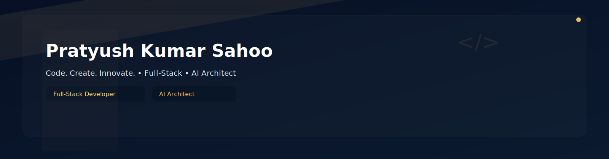

<!-- ═══════════════════════════════════════════════════════════════════════════ -->
<!--                    🌟 PRATYUSH KUMAR SAHOO'S DIGITAL REALM 🌟                   -->
<!-- ═══════════════════════════════════════════════════════════════════════════ -->

<!-- PREMIUM HEADER BANNER -->

 

<!-- SOCIAL MEDIA BADGES -->
<!-- 🎮 GAMING STYLE BADGES -->

<table>
<tr>
<td align="center">
<a href="mailto:pratyushkumarsahoo576@gmail.com">

 <b>Drop a Line</b>
</a>
</td>
<td align="center">
<a href="https://linkedin.com/in/pratyush-kumar-sahoo-775094277">

 <b>Let's Network</b>
</a>
</td>
<td align="center">
<a href="https://instagram.com/pratyush___sahoo">

 <b>Visual Story</b>
</a>
</td>
<td align="center">
<a href="https://github.com/Pratyush768">

 <b>Code & Create</b>
</a>
</td>
</tr>
</table>

 

>

<!-- DIGITAL PROFILE -->

   
  <b> DIGITAL ARCHITECT </b>

### 🌟 Currently Crafting
Next-generation **agricultural intelligence systems** leveraging **computer vision** and **machine learning** for smarter farming solutions.

### ⚡ Core Expertise
- 🤖 **AI/ML Engineering** – YOLO, CNN, TensorFlow, PyTorch  
- 💻 **Full-Stack Development** – React, Node.js, Python, Spring  
- 🌾 **AgTech Innovation** – Cattle scoring, IoT integration, real-time analytics  

### 🚀 Active Projects
- **ATC Cattle Scoring Platform** – Computer Vision + Web App  
- **AI-Powered Personalized Learning Assistant**  
- **IoT-Based Agricultural Monitoring System**

### 📊 Fun Stats
- 🌱 Lines of code written: `∞`  
- 🐄 Cattle scored: Hundreds daily  
- ⚡ Cups of coffee consumed: Professionally excessive  

---

 

<!-- ACTIVE DEVELOPMENT -->

 <b>🚀 ACTIVE DEVELOPMENT</b>

| 🔥 Project | 🎯 Status | 💻 Tech Stack | 🌟 Impact |
|------------|-----------|---------------|-----------|
| **🐄 ATC Cattle Scoring** | `🟢 Production` | YOLO • CNN • React • Node.js | Agricultural Assessment |
| **🤖 AI Tutor Platform** | `🟡 Beta` | Spring AI • React • OpenAI API | Personalized Learning |
| **📊 HDIS Intelligence** | `🔵 Development` | Flask • IoT • NLP • Dash | Disaster Management |
| **👁️ VisionCare Analytics** | `🟣 Research` | TensorFlow • OpenCV • Python | Health Monitoring |

<!-- TECH ARSENAL -->

 <b>⚡ TECH ARSENAL</b>

 

### 🧠 AI/ML Mastery

### 🌐 Full-Stack Development

### 🗄️ Data & Cloud

### 🛠️ Dev Tools

<!-- GITHUB STATS -->

 <b>📊 PERFORMANCE METRICS</b>

 

<!-- TROPHIES -->

 <b>🏆 ACHIEVEMENTS UNLOCKED</b>

 

<!-- CONTRIBUTIONS -->

<!-- FOOTER -->

 

